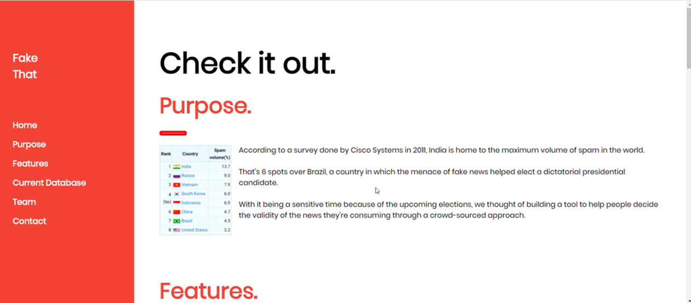
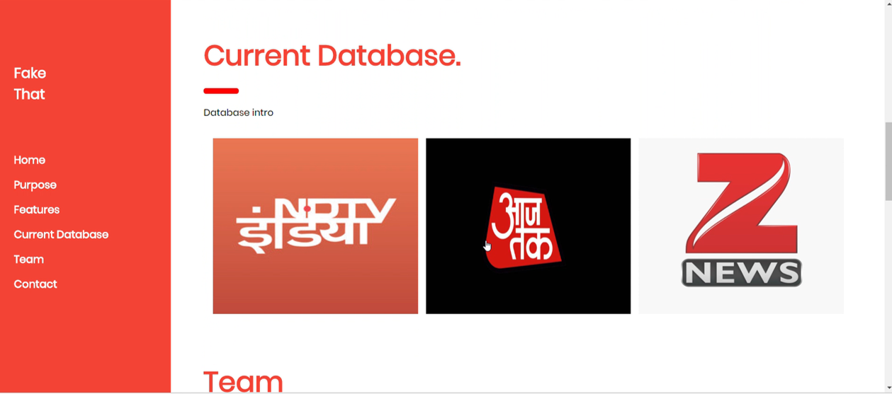
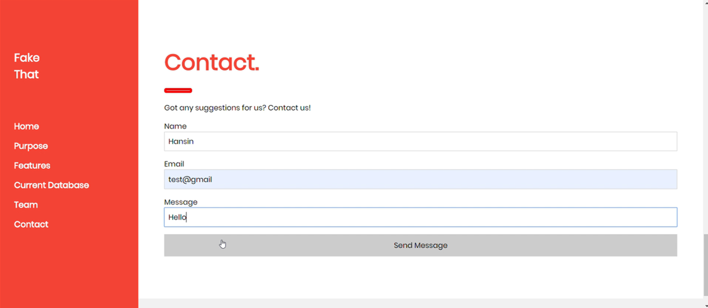
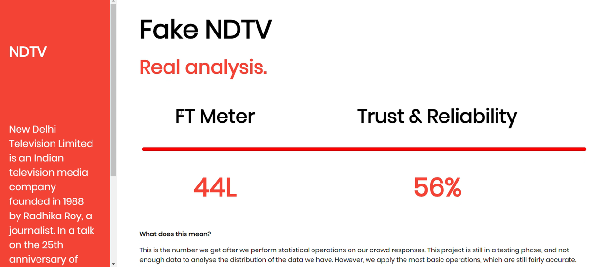
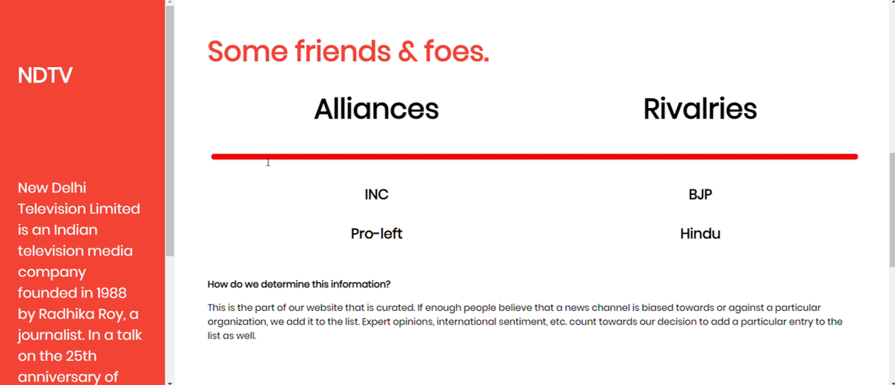

# Fake-That
Part of my Technology Museum course project, this is a website interface to gather public opinion about different news outlets. It uses crowdsourcing techniques to determine public sentiment about a particular news outlet. Technology stack:
- Node.js
- MongoDB
- Firebase
- HTML, CSS and JS

Some snapshots:

    

   

 

   

   

   

   

